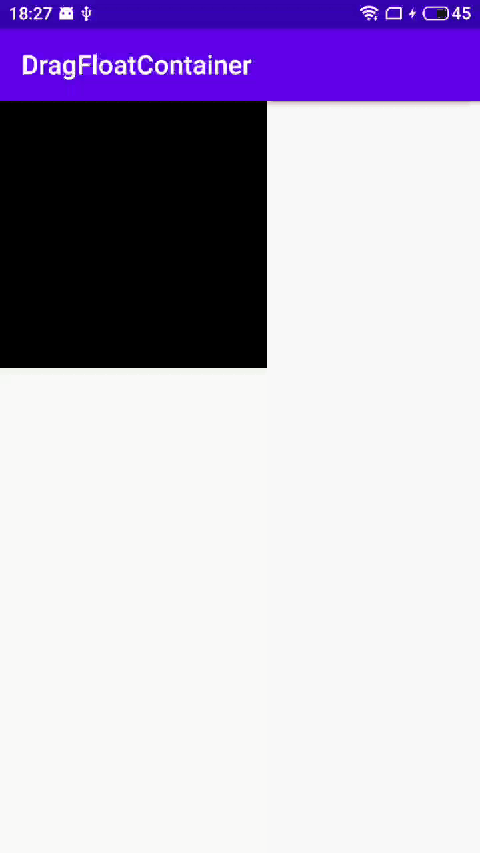

# DragFloatContainer
一个继承自 FrameLayout 简单的可拖拽容器。通过设置 translationX 和 translationY 替代设置 LayoutParameter 避免了频繁请求 requestLayout 的消耗；解决了拖拽和点击事件的拦截和传递。使用者只需要关注真正需要拖拽的子布局的实现。

## 引用
``` groovy
    implementation 'com.freeman.widget:dragfloatcontainer:1.0.0'
```
## 使用方法
``` java
    <com.freeman.widget.dragfloatcontainer.DragFloatContainer
        app:layout_constraintTop_toTopOf="parent"
        app:layout_constraintStart_toStartOf="parent"
        android:layout_width="wrap_content"
        android:focusable="true"
        android:descendantFocusability="blocksDescendants"
        android:focusableInTouchMode="true"
        android:layout_height="wrap_content">

        <com.freeman.dragfloatcontainer.TestChildView
            android:id="@+id/test_view"
            android:background="@android:color/black"
            android:layout_width="200dp"
            android:layout_height="200dp"/>
    </com.freeman.widget.dragfloatcontainer.DragFloatContainer>
```
# 使用示例

